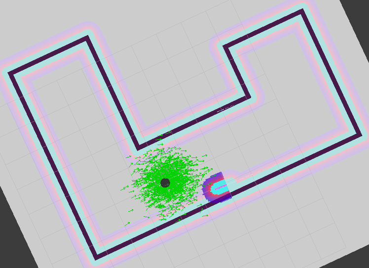
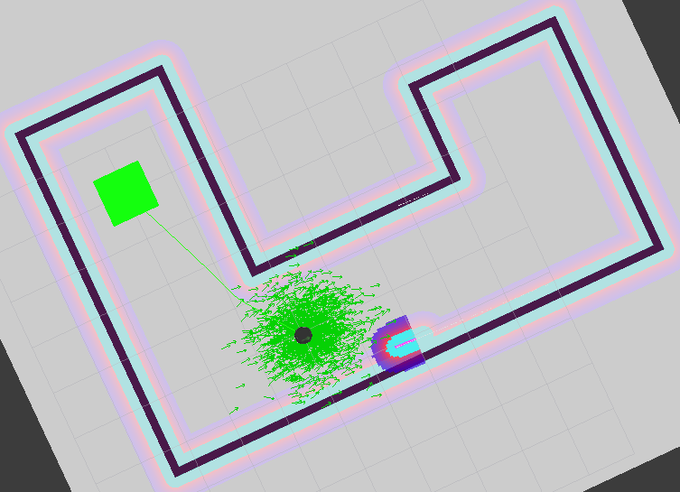
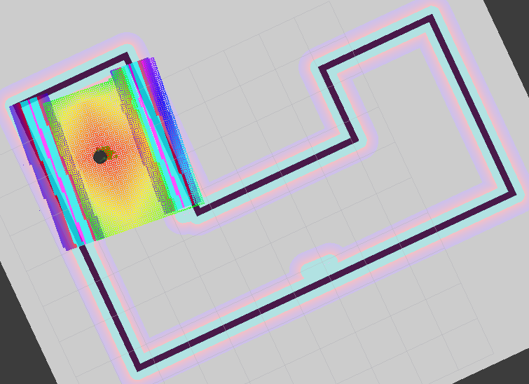
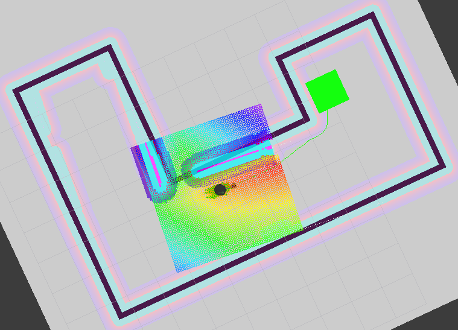
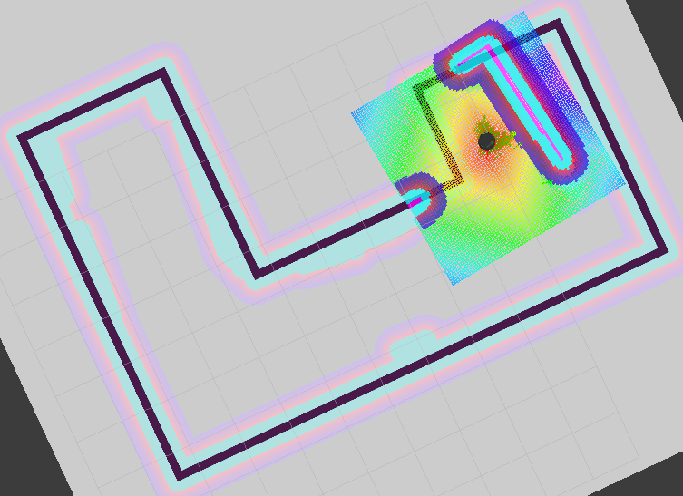

## Overview

This code is for the `Home Service Robot` project of Udacity's `Robotics Software Engineer` Nanodegree.  When executed, the virtual turtlebot robot will be spawned in a gazebo environment.  RVIZ will also be launched in order to visualize SLAM and markers.  The `pick_objects` node will navigate to a pickup location, wait 5 seconds to simulate picking up an object and then navigate to a dropoff location.  The `add_markers` node will add a marker at the pickup location, wait until the `pick_objects` node has posted an updated state to `home_service_robot_state`, and then remove the marker while it is simulating a pickup.  When the `pick_objects` node again updates the state idicating it is finding the dropoff location, the `add_markers` node adds a marker at the dropoff location.  When the robot reaches the dropoff, the `pick_objects` node again updates the state indicating it is dropping off the item and the `add_markers` node removes the marker. The robot's mission is then complete.

## Packages

The packages used in this project include:

- **slam_gmapping** used for performing SLAM
- **turtlebot_gazebo** used for deploying turtlebot in a gazebo environment
- **turtlebot_teleop** used for controlling turtlebot with a keyboard
- **turtlebot_rviz_launchers** used for launching RVIZ

## Running

### Build

```bash
$ cd catkin_ws
$ catkin_make
$ source develop/setup.bash
```

### Launch the Home Service Robot script

```bash
$ cd src/scripts
$ ./home_service.sh
```

### Execution

#### Startup
Just after RVIZ has started, we can see the robot in the map.  The marker will be added shortly after RVIZ subscribes to the marker.



#### Finding Pickup
After the marker is added at the pickup location, the robot plans a path to the pickup location and starts navigating there.



#### Picking Up
After the robot has reached the pickup location and re-oriented itself, the marker is removed and the robot waits 5 seconds while it "picks up" the item.



#### Finding Dropoff
After the marker is added at the dropoff location, the robot plans a path to the dropoff location and starts navigating there.



#### Dropping off
After the robot has reached the dropff location, the marker is removed and the robot's mission is complete.


